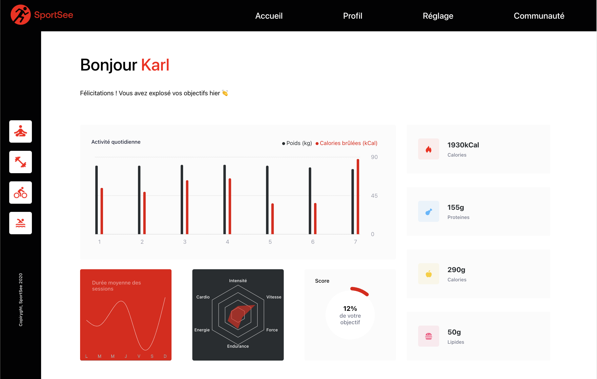
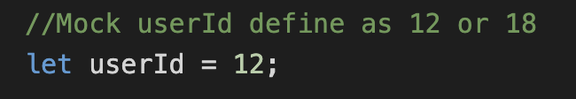

# Sportsee

# SportSee : Analytics Dashboard

A sport coaching app that display a user's data into various charts types.



## 1. Author

Jean Chane-to


## 2. Technologies

- JS
- CSS
- HTML
- CSS
- React
- React Router
- Create React App
- Recharts
- Node.js


## 3. Project

### 3.1 Prerequisites

- [NodeJS (**version 18.13**)](https://nodejs.org/en/)
- [Yarn](https://yarnpkg.com/)
- Backend app [API installation guide](https://github.com/OpenClassrooms-Student-Center/P9-front-end-dashboard) 


### 3.2 Launching the project

- Clone the project on your computer :


    * Either : on github click on green code button, clone, copy link


    * Or : In your terminal :
``` git clone https://github.com/jeanchaneto/sportsee ```
- Install dependencies : ``` npm install ```
- Install/launch back end app, follow instructions on [API repo](https://github.com/OpenClassrooms-Student-Center/P9-front-end-dashboard).
- Launch the project : ``` npm start ```

### 3.3 Displaying data
At the moment only two users present (user id:12 and user id:18) on data base.

Project set on user id:12, to display user id:18 redifine userId variable at top of 

src/hooks/useUserData.js
src/hooks/useUserActivity.js
src/hooks/useUserPerformance.js
src/hooks/useUserAverageSession.js


